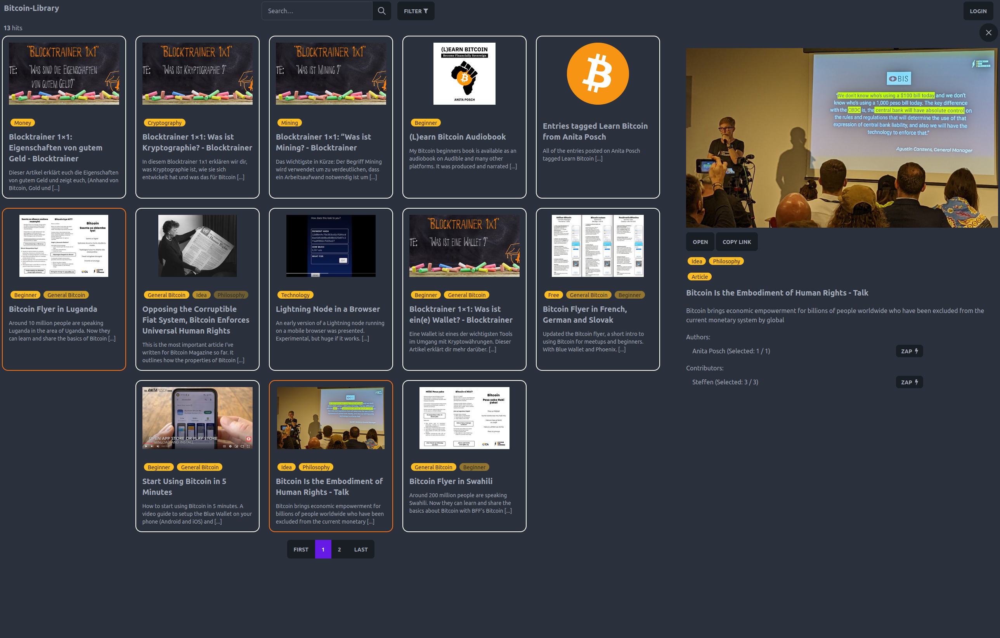
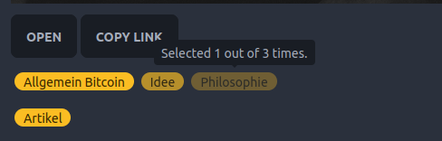

<style>
.sourceCode {
  overflow: auto !important;
}
.container{
  display: flex;
}
.col {
  flex: 1;
  object-fit: contain;
}
</style>


# Bitcoin Library 

A decentralized approach for community based web annotation using Nostr


---

# ME

Steffen

aka @steffenr42 or @laoc42

Researcher and Software Developer in the field of Open Education

🧡 💜 

---

## Agenda

- What's the Problem?
- Central Services VS Fediverse VS Nostr
- Bitcoin Library: Demo
- Bitcoin Library: Under the Hood
- NIPs used and future development

---

## What's the Problem?

- Lots of great educational resources about any kind of topic out there

---

- But though we have Twitter, Mastodon or Twitter-like Nostr clients, where lots of interesting resources are shared, we lack a service to collaborativley annotate resources on the web

---

## Ok, so then just build that service

---

Requirements for educational services (about highly controversial topics):

- decentralized
- censorship-resistant
- Value 4 Value

(V4V Because the content might not be funded from the state or similiar)

---

## Centralization

Twitter, Facebook, Instagram are for obvious reasons not suited for such a service

---

### Fediverse

::: {.container}
:::: {.col}
- based on ActivityPub (W3C)
- very standard oriented
- the walled garden now has doors, doesn't it?
::::
:::: {.col}

::::
:::

---

Though a lot better some problems remain:

- controlled by instance admins
- data hardly moveable
- no value for value

---

### Why is Value 4 Value so important at all?

- People sharing free educational content are doing humanity a great favour
- Lots of use of Creative Common Licenses in Bitcoin space ➡️  makes reusability easier
- But how to provide feedback despite a like?

---

Conclusion for centralized services and the fediverse:

- not decentralized
- easy to censor
- hard to offer incentives for content creators (or annotators)

---

## Bitcoin Library

Example of how community based annotation of web resources could work using a technology like Nostr in the field of Bitcoin education.

---

### Why Nostr?

- By design decentralized
- Hard to censor
- Affinity to Bitcoin and Lightning facilitates V4V

---

# DEMO

---

### Components of the Bitcoin Library

- Metadata-Editor to annotate web resources (Browser Extension)
- "Note Fetcher" to collect notes and transform them
- Frontend to display and search through resources

---

### Browser Extension

::: {.container}
:::: {.col}
- Simple Metadata Editor
- JSON Schema
- SKOS (Simple Knowledge Organization System)
::::
:::: {.col}
{ width=50\% }
::::
:::

---

### Metadata Attributes as Nostr Bots

::: {.container}
:::: {.col}

::::
:::: {.col}
- SKOS Concepts (i.e. controlled vocabularies) set up as bots.
- Every selected entry will repost the resource. 
- So you can follow these bots (and later send them resources as well)
::::
:::

---

### Event Data

```json {.numberLines}
[
  "EVENT",
  "0",
  {
    "id": "bd000c944f40667b9cfc7f1d99e60f456de6f797aa39ebeb12113cac93cbb98c",
    "kind": 1,
    "pubkey": "8af30833be407219d6a2d2a6a84d2cea7d3c212693090fcc2b110ca944c3a617",
    "created_at": 1682689537,
    "content": "Hello! A new resource with title \"Bitcoin Flyer in Swahili\" got added to the library!\n    https://blotcdn.com/blog_378314d0a9ec45bfa46b3bc7d3718410/_thumbnails/b0cefa01-8abe-42ed-89fe-d6a1e79b6e11/large.png\nAround 200 million people are speaking Swahili. Now they can learn and share the basics about Bitcoin with BFF's Bitcoin flyer..\nSent from nostr:npub1j8wdpuqqct23l4gyyxa5dkjvgkxzkjh3n3mzzjj79uhcvh424pcqurytqu (Bitcoin Library).\n    ",
    "tags": [
      [
        "p",
        "8af30833be407219d6a2d2a6a84d2cea7d3c212693090fcc2b110ca944c3a617"
      ],
      [
        "metadata",
        "{\"id\":\"https://anitaposch.com/bitcoin-swahili\",\"name\":\"Bitcoin Flyer in Swahili\",\"description\":\"Around 200 million people are speaking Swahili. Now they can learn and share the basics about Bitcoin with BFF's Bitcoin flyer.\",\"image\":\"https://blotcdn.com/blog_378314d0a9ec45bfa46b3bc7d3718410/_thumbnails/b0cefa01-8abe-42ed-89fe-d6a1e79b6e11/large.png\",\"resourceType\":[{\"id\":0,\"checked\":true,\"title\":\"Artikel\",\"uri\":\"https://w3id.org/bitcoin-library/bots/f631971e-ee83-4c95-9fcf-b1c1639bb4f6\"}],\"keywords\":[{\"id\":1,\"title\":\"Allgemein Bitcoin\",\"uri\":\"https://w3id.org/bitcoin-library/bots/4e42c22d-0b45-4d8a-bb49-6d95d56e2558\",\"checked\":true}],\"authors\":[{\"name\":\"Anita Posch\",\"npub\":\"npub1tjkc9jycaenqzdc3j3wkslmaj4ylv3dqzxzx0khz7h38f3vc6mls4ys9w3\",\"id\":\"4EEmDu8x\"}],\"metadataContributor\":{\"name\":\"\",\"npub\":\"\"}}"
      ]
    ],
    "sig": "b07b2db792ff8c90526e93695dbad1d030a45e4b3e4b64138d0a0aa24d53d5405bcca4a6d4c2231c2eae9b267a0366473c2d0eba63309c259adc7eb2b0a59190"
  }
]
```

---

{ width=50\% }

---

### Note Fetcher

- ETL-work
- polls the relay every 5 seconds to retrieve new data
- Either pushes it directly to the index if URL of resource does not exist
- **OR** Merges the metadata with existing metadata in the index

---

### Frontend



---

### Challenge: Differing Metadata Annotations

In a decentralized annotation system, metadata for the same resource will differ sooner or later

How to handle this?

---

- The note fetcher merges the metadata and sets it in proportion with attributes that were already given. The frontend resembles that through opacity of the tags.



---


 It is not yet an implementation of [(NIP-57)](https://github.com/nostr-protocol/nips/blob/master/57.md), but we use the LUD16 field of the profiles retrieved via the npub of the actor. Then the payment is made using simple WebLN standard


---

## That's it?

Basically yes.

But you might have noticed:

*There is no data in the code*

---

## Easy to adopt

The usage of JSON Schema and SKOS makes the whole approach easily adaptable.

Want to build a library (community) for recipes?

➡️ Create a JSON Schema for it and some vocabularies and go!

---

### NIPs used

- [NIP-1](https://github.com/nostr-protocol/nips/blob/master/01.md)
- [NIP-10](https://github.com/nostr-protocol/nips/blob/master/10.md) to identify the bot in the event
- [NIP-19](https://github.com/nostr-protocol/nips/blob/master/19.md) so clients can correctly substitute npubs with the nostr actors name (if provided)
- [(NIP-57)](https://github.com/nostr-protocol/nips/blob/master/57.md) retrieving lud16 fields from a provided npub to tip the authors

---

## Future Developments

- go public
- [NIP51](https://github.com/nostr-protocol/nips/blob/master/51.md#nip-51) for building lists of interesting content (see <https://listr.lol/>)
- think about UX for mobile users

---

### Questions / Discussion

Thank you!

---

- How to be sure I'm zapping the right person?
- Create a NIP like [94](https://github.com/nostr-protocol/nips/blob/master/94.md) (File Metadata)?

---
