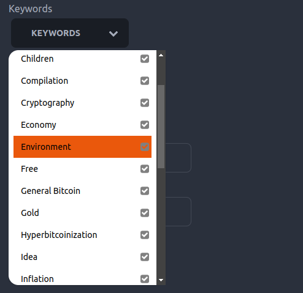

# Bitcoin Library 

A decentralized approach for community based web annotation using Nostr

---

# ME

Steffen

aka @steffenr42 or @laoc42

Researcher and Software Developer in the field of Open Education

🧡 💜 

[Find me on Snort](https://snort.social/p/npub1r30l8j4vmppvq8w23umcyvd3vct4zmfpfkn4c7h2h057rmlfcrmq9xt9ma)

---

## Agenda

- What's the Problem?
- Bitcoin Library: Demo
- Bitcoin Library: Under the Hood
- NIPs used and future development

---

## What's the Problem?

Lots of great educational resources about any kind of topic out there

---

**BUT** we lack a service to collaborativley *collect*, *annotate* and *share* these resources

➡️ to make them *accessible* for teachers and learners

❌ **without** building another centralized platform

---

Requirements for educational services (about highly controversial topics):

- decentralized
- censorship-resistant
- Value 4 Value

(V4V Because the content might not be funded from the state or similiar)

---

### Nostr FTW!

- By design decentralized
- Hard to censor
- Affinity to Bitcoin and Lightning facilitates V4V

---

# DEMO

---

### Components of the Bitcoin Library

- Metadata-Editor to annotate web resources (Browser Extension)
- "Note Fetcher" to collect notes and transform them
- Frontend to display and search through resources

---

### Browser Extension

::: {.container}
:::: {.col}
- Simple Metadata Editor
- JSON Schema
- SKOS (Simple Knowledge Organization System)
::::
:::: {.col}
{ width=50\% }
::::
:::

---

### Metadata Attributes as Nostr Bots

::: {.container}
:::: {.col}

::::
:::: {.col}
- SKOS Concepts (i.e. controlled vocabularies) set up as bots.
- Every selected entry will repost the resource. 
- So you can follow these bots (and later send them resources as well)
::::
:::

---

{ width=50\% }

---

### Note Fetcher

- ETL-work
- polls the relay every 5 seconds to retrieve new data
- Either pushes it directly to the index if URL of resource does not exist
- **OR** Merges the metadata with existing metadata in the index

---

### Frontend

---

### Challenge: Differing Metadata Annotations

In a decentralized annotation system, metadata for the same resource will differ sooner or later

How to handle this?

---

- The note fetcher merges the metadata and sets it in proportion with attributes that were already given. The frontend resembles that through opacity of the tags.

---

 It is not yet an implementation of [(NIP-57)](https://github.com/nostr-protocol/nips/blob/master/57.md), but we use the LUD16 field of the profiles retrieved via the npub of the actor. Then the payment is made using simple WebLN standard

---

## That's it?

Basically yes.

But you might have noticed:

*There is no data in the code*

---

## Easy to adopt

The usage of JSON Schema and SKOS makes the whole approach easily adaptable.

Want to build a library (community) for recipes?

➡️ Create a JSON Schema for it and some vocabularies and go!

---

### NIPs used

- [NIP-1](https://github.com/nostr-protocol/nips/blob/master/01.md) 
- [NIP-7](https://github.com/nostr-protocol/nips/blob/master/07.md) `window.nostr`; Login with Alby
- [NIP-10](https://github.com/nostr-protocol/nips/blob/master/10.md) to identify the bot in the event
- [NIP-19](https://github.com/nostr-protocol/nips/blob/master/19.md) so clients can correctly substitute npubs with the nostr actors name (if provided)
- [NIP51](https://github.com/nostr-protocol/nips/blob/master/51.md#nip-51) for building lists of interesting content (see <https://listr.lol/>)
- [(NIP-57)](https://github.com/nostr-protocol/nips/blob/master/57.md) retrieving lud16 fields from a provided npub to tip the authors

---

## Future Developments

- go public
- fill with resources
- think about UX for mobile users
- build a community
- add i18n

---

### Questions / Discussion

Thank you!

---
